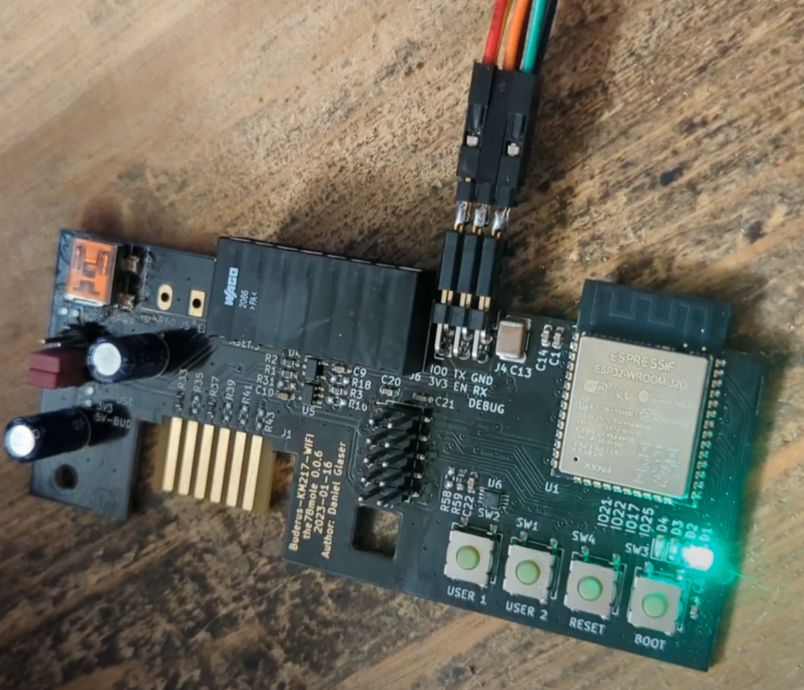

# About

The KM271-WiFi is an addon to the (oldish) Buderus oil heating control units like the Logamatic 2107.

More details can be found on my [blog](https://the78mole.de/reverse-engineering-the-buderus-km217/) or the [project page](https://the78mole.de/projects/km271-wifi-howto/).

The hardware itself is available on [tindie](https://www.tindie.com/products/24664/).

The esphome component has a [separate repo](https://github.com/the78mole/esphome_components).

# Installation

You can use the button below to install the pre-built firmware directly to your device via USB and a USB-serial converter (3,3V TTL) from the browser.

<esp-web-install-button manifest="firmware/km271-for-friends.manifest.json"></esp-web-install-button>

A Video, how to connect and flash the device can be found on my [YouTube channel](https://youtu.be/h_pQlpXaQ1I).

The IO0 and EN pins of the ESP32 don't need to be connected to the USB-Serial converter, but then you need to enter flashing mode by pressing the buttons BOOT and RESET as shown in the video: Hold down BOOT while pressing RESET, then release BOOT again.

